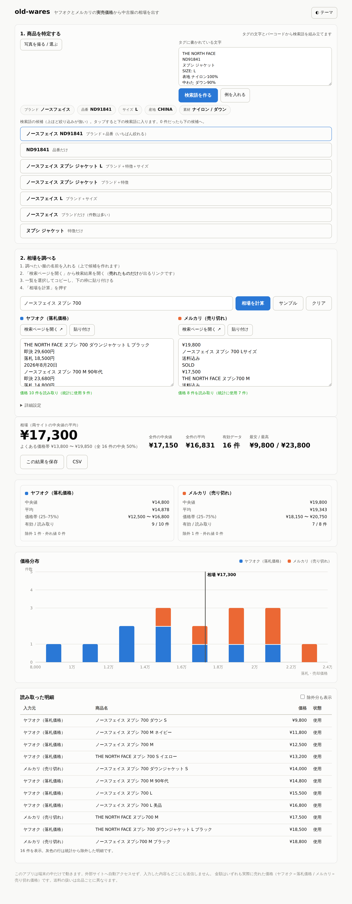

# old-wares — 中古服の相場を調べるツール

ヤフオク（落札価格）とメルカリ（売り切れ）の検索結果を**コピーして貼り付ける**と、
中央値・平均・価格帯・価格分布を出します。

スマホのホーム画面に置いて、タップで起動できます（PWA）。
**サーバーもインターネット接続も要りません。** 全部ブラウザの中で動き、
入力した内容はどこにも送信されません。機内モードでも使えます。



## スマホに入れる

<https://pandaman001-art.github.io/old-wares/> を開いて、

- **iPhone（Safari）**: 共有ボタン → 「ホーム画面に追加」
- **Android（Chrome）**: メニュー（⋮） → 「アプリをインストール」

以降はホーム画面のアイコンをタップすれば、アドレスバーなしで起動します。
初回に開いた時点でアプリ本体が端末にキャッシュされるので、圏外でも立ち上がります。

> リポジトリを clone した直後は、GitHub Pages を有効にする必要があります。
> Settings → Pages → Source を「Deploy from a branch」、Branch を `main` / `/ (root)` にして保存してください。

## 使い方

**1. 商品を特定する** — タグに書かれている文字を打つ（または貼る）と、ブランド・品番・サイズを
取り出して検索語の候補を並べます。Android なら「バーコードを読む」でカメラから JAN を読めます。

**2. 相場を調べる** — 候補をタップして検索語に入れ、「検索ページを開く ↗」でヤフオク／メルカリの
検索結果（**売れたものだけ**が出るリンク）を開き、一覧をコピーしてアプリに戻って「貼り付け」。
あとは「相場を計算」。

まず触ってみるだけなら「例を入れる」「サンプル」で動作を確認できます。

## 商品の特定

### タグの文字から

タグを見たまま打ち込む（または撮ったテキストを貼る）と、こう分解します。

```
THE NORTH FACE        → ブランド: ノースフェイス
ND91841               → 品番: ND91841
ヌプシ ジャケット       → 特徴: ヌプシ / ジャケット
SIZE: L               → サイズ: L
表地 ナイロン100%       → 素材: ナイロン（検索語には使わない）
MADE IN CHINA         → 産地: CHINA
```

そこから、**絞り込みの強い順に**検索語の候補を出します。

| 候補 | 絞り込み |
| --- | --- |
| `ノースフェイス ND91841` | ブランド＋品番（いちばん絞れる） |
| `ND91841` | 品番だけ |
| `ノースフェイス ヌプシ ジャケット L` | ブランド＋特徴＋サイズ |
| `ノースフェイス ヌプシ ジャケット` | ブランド＋特徴 |
| `ノースフェイス` | ブランドだけ（件数は多い） |

中古サイトは語を増やすほど 0 件になりやすいので、**落とす先**を必ず用意しています。
上から試して、件数が足りなければ下の候補へ。

読み取りの細かい判断:

- 英字表記からカナの通称を引きます（`THE NORTH FACE` → `ノースフェイス`）。中古サイトの出品は
  カナ表記が多いためです。約 60 ブランドを `js/brands.js` に持っています。
- 品番は行ごとに探します。`RETRO-X` の次の行に `23056` があっても `X23056` とは繋ぎません。
- 数字だけの行は、身長・ウエストとして妥当な範囲（70〜190 / 23〜46）ならサイズ、
  そうでなければ品番として扱います。`501` は品番、`120` はサイズです。
- 組成や取扱表示（`ナイロン100%`、`液温40度を限度`…）は検索語に混ぜません。

### バーコードから

ブラウザ標準の `BarcodeDetector` だけを使うので、**Android の Chrome などでは使えますが
iPhone の Safari では使えません**（iOS に標準機能が無く、読み取りライブラリは同梱していません）。
対応していない端末ではボタン自体が出ません。

読み取った番号は、チェックディジットを検証して国コードまで表示し、そのまま検索語にします。
番号から商品名を引くことはしません（そのためのデータベースを持たず、外部にも問い合わせないため）。
新品同様でタグが残っている品には効きますが、古着では JAN が書かれていないことのほうが多いです。

### 写真について

**写真から商品名を自動で判別することはしません。** 画像認識を積んでいないためです。
取り込んだ写真は「あとで見返したときにどの服だったか分かる」ための記録として、
保存した調査に一緒に残ります（長辺 1024px の JPEG に縮小して保存）。

## 「相場」の定義

トップに出る大きな金額は **両サイトの中央値を等ウェイトで平均した値** です。

```
相場 = (ヤフオクの中央値 + メルカリの中央値) / 2
```

平均ではなく中央値を使うのは、極端な高値・安値 1 件で数字が動かないようにするためです。
また件数ではなく等ウェイトにしているのは、片方のサイトに件数が偏っても
相場がそちらに引っ張られないようにするためです。件数で加重した値
（＝全件をプールした平均）も「全件の平均」として並べて表示しています。
片方だけ貼った場合はそのサイトの中央値がそのまま相場になり、その旨を画面に出します。

| 表示 | 中身 |
| --- | --- |
| 相場 | 各サイトの中央値の単純平均（推奨値） |
| 全件の中央値 | 両サイトをプールした中央値 |
| 全件の平均 | 両サイトをプールした平均（件数で加重されたもの） |
| よくある価格帯 | プールした第 1 四分位 〜 第 3 四分位（中央 50%） |

## 貼り付けの読み取り

貼り付けたテキストは、行の並びではなく「金額らしい行」と「商品名らしい行」の距離で
対応づけます。サイトによって価格が商品名の前に来たり後ろに来たりするためです。

読み取れる形:

- **ヤフオク型**（商品名 → 価格 → 日付）。`即決 32,000円` と `落札 18,500円` が並んでいる場合、
  **落札価格のほうだけ**を採ります。即決・開始価格・現在価格の行は捨てます。
- **メルカリ型**（`¥12,800` → 商品名 → `送料込み` → `SOLD`）。
- **1 行に混在**（`ノースフェイス ヌプシ 700 L 18,500円 2026年9月1日`）。
  商品名からは金額と末尾の日付を落とします。
- **CSV / TSV**（`商品名,価格` または タブ区切り）。価格は右端の数値列。
- **価格だけの列**（`18500` を 1 行ずつ）。ただし通貨記号が 1 つも出てこない貼り付けに限ります。
  `¥` や `円` が混ざっているテキストでは、`700`（サイズ）のような裸の数字を価格と見なしません。

`送料込み` `SOLD` `ウォッチ` `残り◯日` などの一覧ページの飾りや日付行は無視します。
読み取った件数は各枠の下にすぐ出るので、貼り付けが効いているかその場で確認できます。

## ノイズの除去

中古服の実売データは、そのまま平均すると簡単に歪みます。統計に入れる前に落としています。

- **キーワード除外**（既定 ON）: まとめ売り / セット売り / ジャンク・訳あり / レプリカ /
  キッズ・ペット用 / 型紙・カタログ等の「商品違い」/ 本体でないもの。
  ただし **検索語自体に含まれる語のルールは自動的に無効** になります。
  「キッズ ダウン」で探したときに「キッズ」で全部落ちる、といった事故を防ぐためです。
  「セットアップ」は「セット売り」と誤判定しません。
- **価格ガード**: 既定で 300 円未満・300 万円超を除外。詳細設定から変更できます。
- **外れ値除去**（既定 ON）: IQR 法（Tukey, k=1.5）。有効データが 8 件未満のときは何もしません。

除外された明細は捨てずに残してあり、「除外分も表示」で理由つきに確認できます。
CSV には除外分も理由つきで出力されます。

## 保存

「この結果を保存」を押すと、貼り付けた内容・タグの文字・バーコード・写真ごと端末内（IndexedDB）に残ります。
一覧から「開く」で再計算でき、前に調べたときいくらだったかを見返せます。
入力中の内容も自動で退避するので、アプリを閉じて検索結果を見に行っても消えません。
データは端末から出ないので、機種変更時は引き継がれません。

## 開発

ビルド不要。依存パッケージもありません。

```bash
# ローカルで動かす（任意の静的サーバーで可）
python3 -m http.server 8000
# → http://127.0.0.1:8000
# Service Worker は localhost か HTTPS でのみ動きます

npm test    # 95 tests（Node 18+ 同梱のテストランナー、追加インストール不要）
```

構成:

```
index.html              画面（CSS 込み）
manifest.webmanifest    PWA の定義（アイコン・起動時の見た目）
sw.js                   Service Worker。アプリ本体をキャッシュしてオフライン起動を可能にする
js/
  identify.js           タグの文字 → ブランド・品番・サイズ → 検索語の候補
  brands.js             ブランドの表記ゆれ表（英字 ↔ カナ）
  barcode.js            バーコード読み取りと JAN の検証
  photo.js              写真の縮小（記録用）
  parsing.js            貼り付けテキスト → 商品名と価格
  normalize.js          検索語の正規化と除外ルール
  stats.js              要約統計 / IQR 外れ値 / ヒストグラム
  quote.js              入力グループをまとめて相場を組み立てる
  store.js              保存（IndexedDB）と下書き（localStorage）
  chart.js              価格分布の積み上げヒストグラム（インライン SVG）
  app.js                画面の組み立てとイベント配線
icons/                  アイコン（SVG 原本と書き出した PNG）
tests/                  95 tests
```

## 既知の制約

- 検索結果の**コピーは手作業**です。ヤフオクは 1 ページ 100 件表示にできるので、
  1〜2 回のコピーで十分な件数が集まります。
- メルカリの検索結果には売却日時が出ないため、日付は扱っていません。
  ヤフオクの日付も商品名から取り除くだけで、統計には使っていません。
- 送料込み / 送料別は出品ごとに異なり、価格には反映していません。
- サイズ・状態・年式での絞り込みは、検索語と除外語で行う形です。
- 保存したデータは端末のブラウザ内にあります。サイトデータを消すと一緒に消えます。
- 写真から商品名は判別しません（上記「写真について」）。
- バーコードは Android など `BarcodeDetector` に対応した端末でのみ読めます。
- ブランド表記の辞書は約 60 件です。載っていないブランドはタグの文字がそのまま検索語になります。
